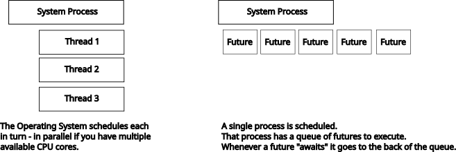

# Threads vs Async Rust

There are two major types of concurrency in Rust:

* Threads.
* Asynchronous Code.

The two are linked, but are different things---with different purposes.

> Knowing when to use threads and when to use async code makes a *huge* difference in performance---and makes you a happier programmer, using the solution that fits the problem.

